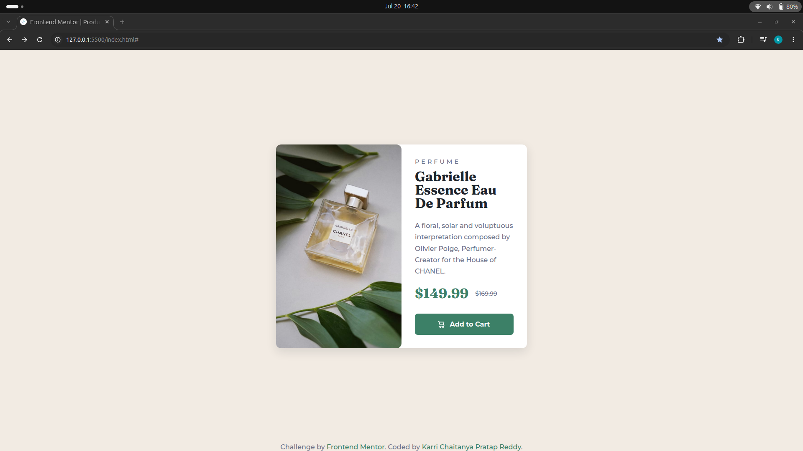
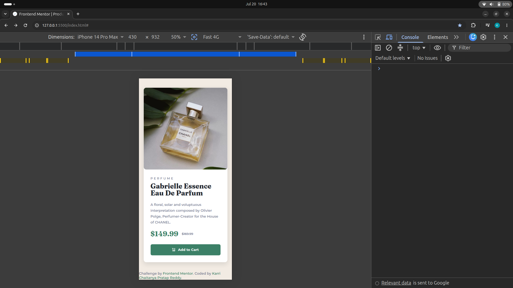

# Product Preview Card Component

A responsive product preview card built using **HTML5** and **CSS3** as part of a Frontend Mentor challenge. The project focuses on creating a clean, responsive layout while following modern web development practices.

## 📸 Preview

![Project Preview]



## 🔗 Links

- **Live Site:** https://kcprdev.github.io/frontend-practice/product-preview-card/
- **Repository:** https://github.com/kcprdev/frontend-practice/tree/main/product-preview-card
- **Frontend Mentor Challenge:** https://www.frontendmentor.io/challenges/product-preview-card-component-GO7UmttRfa

---

## 🛠️ Built With

- HTML5
- CSS3
- CSS Grid
- Flexbox
- CSS Variables
- Responsive Design
- Google Fonts (Montserrat & Fraunces)

---

## ✨ Features

- 📱 Responsive layout for desktop and mobile devices
- 🖼️ Responsive product image using the `<picture>` element
- 🎨 Modern UI matching the Frontend Mentor design
- ♿ Keyboard focus styles for accessibility
- ✨ Smooth hover and active button animations
- 📦 Clean and semantic HTML structure

---

## 📂 Project Structure

```text
product-preview-card/
│
├── images/
│   ├── favicon-32x32.png
│   ├── icon-cart.svg
│   ├── image-product-desktop.jpg
│   └── image-product-mobile.jpg
│
├── index.html
├── style.css
├── preview.jpg
└── README.md
```

---

## 📚 What I Learned

While building this project, I practiced:

- Writing semantic HTML
- Building responsive layouts with CSS Grid and Flexbox
- Using CSS custom properties (variables)
- Styling interactive elements with hover, active, and focus states
- Using the `<picture>` element for responsive images
- Working with Google Fonts
- Improving accessibility through semantic markup and focus styles

---

## 🚀 Future Improvements

- Add subtle entrance animations
- Improve accessibility further with additional ARIA attributes
- Continue refining spacing and typography for pixel-perfect accuracy

---

## 👨‍💻 Author

**Karri Chaitanya Pratap Reddy**

- GitHub: https://github.com/kcprdev
- Frontend Mentor: https://www.frontendmentor.io/profile/kcprdev
- LinkedIn: https://www.linkedin.com/in/karri-chaitanya-pratap-reddy

---

## 🙏 Acknowledgements

This project was completed as part of a challenge from **Frontend Mentor**, a platform that provides real-world frontend development practice.

---
⭐ If you found this project helpful or have any feedback, feel free to open an issue or connect with me.